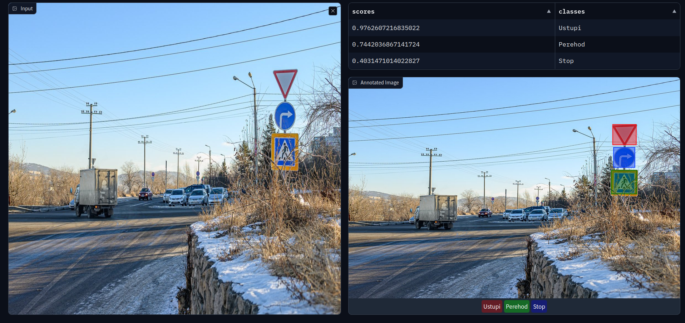

# CV_in_practice

## Требуемые зависимости 

Ключевым требованием к работе приложения является наличие интерпретатора **Python** версии *3.10* или выше. 

## Установка
Для запуска приложений надо установить зависимости с помощью pdm
```shell
pdm install --prod
```
или `requrenments.txt`
```shell
pip install -r requirements.txt
```
## Запуск
Для запуска надо выполнить команду
```shell
python src/app.py
```
Приложение будет выглядеть так:


## Масштабируемость

Приложение разработано с учетом масштабируемости и легкости использования на локальных машинах пользователей.

## Разработка
Для разработки надо установить все библиотеки и скрипты для форматирования кода
```shell
pdm install
pre-commit install --install-hooks
```

## Эксперименты

Целевой метрика: **Recall**, нам важнее распознать как можно больше знаков, так как водитель может не заметить конкретный знак, но зато точно обработает ложное срабатывание.

Обучение и валидация проводились в Colab:

- GPU: 1x Tesla T4
- CPU: 1x Xeon Processor @2.3Ghz
- RAM: ~12.6 GB

|          | precision  | recall | mAP50 | mAP50-95 | fitness    | inference speed / sec  |
| -------- | --------   | -------|-------| -------  | -------    |    -------             |
| YOLOv8s  | 0.672      |  0.496 | 0.566 | 0.413    | 0.428      |    2.56                |
| YOLOv8n  | 0.583      |  0.498 | 0.531 | 0.390    | 0.405      |    1.80                |

Был проведен [перебор параметров (cos_lr, label_smoothing, lr0, optimizer. warmup_momentum) для обучения](./runs.csv) с использованием optuna до 10 эпох.

| Параметр        | лучший результат |
| label_smoothing | 0.427559         |
| lr0             | 0.006689         |
| optimizer       | AdamW            |
| warmup_momentum | 0.815399         |
| epochs          | 8                |
| mAP50-95B       | 0.246398         |
| mAP50B          | 0.355854         |
| precisionB      | 0.617098         |
| recallB         | 0.341001         |
